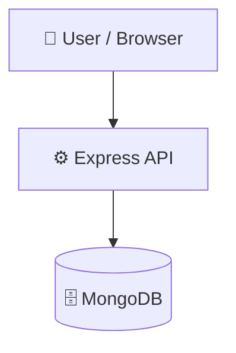

# Webhook-Event-Transformation-Pipeline

      

## 📑 Table of Contents

- [Description](#description)
- [Screenshots](#screenshots)
- [Tech Stack](#tech-stack)
- [Architecture](#architecture)
- [Quick Start](#quick-start)
- [Key Dependencies](#key-dependencies)
- [Available Scripts](#available-scripts)
- [Project Structure](#project-structure)
- [Development Setup](#development-setup)
- [Contributors](#contributors)
- [Contributing](#contributing)
- [License](#license)

## 📝 Description

Webhook-Event-Transformation-Pipeline — a backend api built with Express.js, JavaScript, MongoDB, Vite.

## 📸 Screenshots


## 🛠️ Tech Stack

   

**Notable libraries:** Mongoose

## 🏗️ Architecture

A high-level view of how the main pieces fit together:



## ⚡ Quick Start

```bash

# 1. Clone the repository
git clone https://github.com/sahilydvvv/Webhook-Event-Transformation-Pipeline.git

# 2. Install dependencies
npm install

# 3. Start the dev server
npm run start
```

## 📦 Key Dependencies

```
bcryptjs: ^2.4.3
body-parser: ^1.20.2
cookie-parser: ^1.4.6
cors: ^2.8.5
dotenv: ^16.0.3
express: ^5.2.1
jsonwebtoken: ^9.0.0
mongoose: ^7.0.0
nodemon: ^3.1.11
```

## 🚀 Available Scripts

- **start** — `npm run start`
- **dev** — `npm run dev`

## 📁 Project Structure

```
.
├── backend
│   ├── config
│   │   └── db.js
│   ├── controller
│   │   ├── auth.controller.js
│   │   ├── createEvent.controller.js
│   │   ├── getEvents.controller.js
│   │   ├── razorpay.controller.js
│   │   ├── rule.controller.js
│   │   └── webhook.controller.js
│   ├── middleware
│   │   └── auth.middleware.js
│   ├── model
│   │   ├── Rule.js
│   │   ├── User.js
│   │   └── Webhook.js
│   ├── package.json
│   ├── routes
│   │   ├── events.route.js
│   │   ├── razorpay.route.js
│   │   ├── rule.route.js
│   │   ├── user.route.js
│   │   └── webhook.route.js
│   ├── server.js
│   ├── services
│   │   ├── normalizers
│   │   │   ├── githubNormalizer.service.js
│   │   │   └── razorpayNormalizer.service.js
│   │   ├── router.service.js
│   │   ├── slack.service.js
│   │   └── transformers
│   │       ├── github.transformer.js
│   │       └── razorpay.transformer.js
│   ├── test.txt
│   └── util
│       └── token.js
└── frontend
    ├── eslint.config.js
    ├── index.html
    ├── package.json
    ├── public
    │   ├── favicon.svg
    │   └── icons.svg
    ├── src
    │   ├── App.jsx
    │   ├── assets
    │   │   ├── hero.png
    │   │   ├── react.svg
    │   │   └── vite.svg
    │   ├── context
    │   │   └── AuthContext.jsx
    │   ├── index.css
    │   ├── layout
    │   │   └── AppLayout.jsx
    │   ├── main.jsx
    │   ├── pages
    │   │   ├── Dashboard.jsx
    │   │   ├── Events.jsx
    │   │   ├── Login.jsx
    │   │   ├── Rules.jsx
    │   │   └── Signup.jsx
    │   └── services
    │       ├── authService.js
    │       ├── eventService.js
    │       └── ruleService.js
    └── vite.config.js
```

## 🛠️ Development Setup

### Node.js / JavaScript
1. Install Node.js (v18+ recommended)
2. Install dependencies: `npm install` (or `yarn` / `pnpm install` / `bun install`)
3. Start the dev server: see the **Quick Start** above

## 👥 Contributors

Thanks to everyone who has contributed to this project:

<p align="left">
<a href="https://github.com/sahilydvvv" title="sahilydvvv"></a>
<a href="https://github.com/RamSharma22" title="RamSharma22"></a>
<a href="https://github.com/PUNIT-CS23" title="PUNIT-CS23"></a>
<a href="https://github.com/Raghu64-code" title="Raghu64-code"></a>
<a href="https://github.com/rajasisodia" title="rajasisodia"></a>
</p>

[See the full list of contributors →](https://github.com/sahilydvvv/Webhook-Event-Transformation-Pipeline/graphs/contributors)

## 👥 Contributing

Contributions are welcome! Here's the standard flow:

1. **Fork** the repository
2. **Clone** your fork: `git clone https://github.com/sahilydvvv/Webhook-Event-Transformation-Pipeline.git`
3. **Branch**: `git checkout -b feature/your-feature`
4. **Commit**: `git commit -m 'feat: add some feature'`
5. **Push**: `git push origin feature/your-feature`
6. **Open** a pull request

Please follow the existing code style and include tests for new behavior where applicable.

## 📜 License

This project is licensed under the **ISC** License.

---

<div align="center">

[](https://readmebuddy.com)

<sub>Generate beautiful READMEs in seconds → <a href="https://readmebuddy.com">readmebuddy.com</a></sub>

</div>
